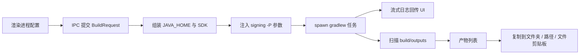

# 匠包（PackForge）产品需求文档（PRD）

| 字段 | 内容 |
|------|------|
| 产品中文名 | 匠包 |
| 产品英文名 | PackForge |
| 文档版本 | v1.2 |
| 状态 | 已确认技术栈，待开发 |
| 仓库 | `android-packing-tools` |
| 目标平台 | macOS、Windows |
| 作者 | PackForge 产品设计 |
| 最近更新 | 2026-09-07 |

## 修订记录

| 版本 | 日期 | 说明 |
|------|------|------|
| v1.2 | 2026-09-07 | 产物分享取消拖出；改为复制到文件夹 / 路径 / 文件剪贴板；开发任务见 `features/` |
| v1.1 | 2026-09-07 | 移除 JDK 在线下载/缓存能力；JDK 仅支持导入本机已安装路径 |
| v1.0 | 2026-09-07 | 首版：背景、技术栈锁定、完整功能与验收标准 |

---

## 1. 文档信息与范围

本文档定义 **匠包（PackForge）** 的产品目标、技术栈、功能需求、交互规则、数据模型、安全边界与里程碑。实现时以本文为准；超出「非目标」的能力不得挤入 MVP。

**开发任务拆分：** 从脚手架到可安装发布的顺序任务见仓库 [features/README.md](../features/README.md)（F01–F14）。会话中提及「开始执行 Fxx」即执行对应任务。

**一句话定位：** 面向 Android 工程师的**本地 Gradle 打包工作台**——指定工程后，用项目自带 `gradlew` / `gradlew.bat` 打 APK / AAB，不经过 Android Studio IDE，避免 IDE 层同步/上传签名与未知遥测。

---

## 2. 背景与问题

### 2.1 现状

在最新 Android Studio 中，通过 IDE 的「Generate Signed Bundle / APK」或相关向导打包时，用户感知到会**默认上传签名信息以及其他未知信息**。即便用户只想在本机完成一次 release/debug 构建，也会被 IDE 行为干扰。

已知可行绕过方式：在项目根目录（或 Android 子工程目录）使用 **Gradle Wrapper** 执行打包命令，例如：

```bash
./gradlew :app:bundleProdRelease
./gradlew :app:assembleDevDebug
```

配合 AGP 注入签名属性（见第 9 章），可在不打开 Android Studio 的情况下完成签名构建。

### 2.2 痛点

| 痛点 | 说明 |
|------|------|
| 隐私与可控性 | IDE 打包路径不可控，用户无法确认上传了什么 |
| 命令记忆成本 | `assemble` / `bundle`、flavor、buildType 组合繁琐易错 |
| JDK 切换 | 多项目要求不同 JDK，手动改 `JAVA_HOME` 易混 |
| 签名管理 | keystore 路径、密码、别名分散，易写进工程文件泄露 |
| 产物分发 | 打完后找 APK/AAB/`mapping.txt`，再复制到文件夹或 IM，步骤多 |

### 2.3 机会

做一个**纯本地、零遥测**的桌面工具：选项目 → 选 JDK / 签名 / 变体 → 一键 Gradle 打包 → 产物列表支持复制到文件夹 / 路径 / 文件剪贴板。全程不依赖 Android Studio GUI。

---

## 3. 目标与非目标

### 3.1 目标（Goals）

1. 指定 Android 项目路径，自动识别 macOS / Windows 下应使用的 Wrapper 脚本。
2. 导入并管理本机已安装的多个 JDK，打包时可选 `JAVA_HOME`（不提供在线下载）。
3. 管理签名档案（keystore、密码、别名），打包时注入签名且**不修改**工程 `build.gradle`。
4. 读取并展示 `buildType` / `productFlavor`（及维度组合），拼装 `assembleXxx` / `bundleXxx` 任务。
5. 打包结束后汇总产物（APK、AAB、`mapping.txt` 等），支持单选/多选复制到文件夹、复制路径、写入系统文件剪贴板（便于粘贴到访达/资源管理器/部分 IM）。**不做**从列表拖出到外部应用。
6. 同一套产品覆盖 macOS 与 Windows。
7. 品牌与视觉按「本地工坊 / 不上云」vibe 设计（见第 6 章）。

### 3.2 非目标（Non-Goals，MVP 不做）

- 不替代 Android Studio 做编码、调试、Layout 预览。
- 不自动上传 Google Play / 应用商店。
- 不内置完整 Android SDK 安装器（仅检测/引导配置 `ANDROID_HOME` 或 `sdk.dir`）。
- **不提供 JDK 在线下载、镜像分发或应用内缓存安装包**（用户自行安装后，在本应用中导入路径即可）。
- 不解析/执行非 Wrapper 的系统全局 `gradle` 作为默认路径。
- 不采集使用遥测、崩溃上报到第三方（可选本地日志文件除外）。
- 不做 CI 服务器、多机队列调度。
- 不支持 iOS / Flutter 非 Android 工程作为一等公民（若目录含 Android 子工程可手动指向）。

---

## 4. 用户与典型场景

### 4.1 目标用户

- Android 应用 / SDK 工程师，日常需要打 debug/release APK 或上架用 AAB。
- 对签名与构建隐私敏感、希望绕开 IDE 上传行为的开发者。
- 需要在 Mac / Windows 双机或双系统间使用同一工作流的同学。

### 4.2 用户故事

| ID | 故事 | 优先级 |
|----|------|--------|
| US-1 | 作为开发者，我选择项目后希望工具自动找到正确的 `gradlew`，这样我不用记平台差异 | P0 |
| US-2 | 作为开发者，我选择 JDK 17/21 再打包，这样不同项目不会互相污染环境 | P0 |
| US-3 | 作为开发者，我选签名档案后直接打 release，且密码不写进工程文件 | P0 |
| US-4 | 作为开发者，我勾选 flavor=`Prod`、buildType=`Release`、产物类型=`AAB`，一键生成 `bundleProdRelease` | P0 |
| US-5 | 作为开发者，打包完成后我多选 APK + mapping，复制到共享盘或通过文件剪贴板粘贴发给同事 | P0 |
| US-6 | 作为开发者，我在多模块工程里选择正确的 `app` 模块再打包 | P0 |
| US-7 | 作为开发者，我把本机已安装的 JDK 17/21 导入列表并在打包前切换 | P0 |

### 4.3 典型场景流

```text
打开匠包 → 选择/最近打开项目 → 校验 Wrapper + SDK
  →（可选）刷新变体列表 → 选择模块 / Flavor / BuildType / APK|AAB
  → 选择 JDK + 签名档案 → 开始打包 → 实时看日志
  → 成功 → 产物面板勾选 → 复制到文件夹 / 复制路径 / 文件剪贴板
```

---

## 5. 技术栈与架构

### 5.1 技术栈决策（已锁定）

| 层 | 选型 | 用途 |
|----|------|------|
| 桌面壳 | **Electron 33** | 无沙箱限制地选目录、拉起 Gradle、写系统文件剪贴板、复制产物到目标文件夹 |
| 渲染层 | **React 19 + TypeScript 5 + Vite** | 打包工作台 UI |
| 样式 | **Tailwind CSS 4** | 「本地工坊 / 深色专业工具」风格 |
| 状态 | **Zustand** | 项目、JDK、签名、打包任务、产物多选 |
| 配置存储 | **electron-store** | 非敏感配置（路径、最近项目、JDK 列表元数据等） |
| 密钥存储 | **keytar** | 签名密码写入 macOS Keychain / Windows Credential Manager |
| 子进程 | Node `child_process.spawn` | 流式输出 Gradle stdout/stderr |
| 安装包 | **electron-builder** | macOS `dmg`/`zip`（arm64 + x64）、Windows `nsis` |
| 签名注入 | AGP `-Pandroid.injected.signing.*` | 不改项目构建脚本 |

#### 5.1.1 明确不选的方案

| 方案 | 否决理由 |
|------|----------|
| **Tauri 2** | 体积更小，但系统文件剪贴板与桌面工程生态成熟度不如 Electron；MVP 优先交付速度与资料完整度 |
| **Compose Multiplatform** | 产品需管理用户 JDK，再捆绑 JRE 别扭；文件剪贴板与长日志终端体验弱于 Electron |
| **Flutter Desktop** | 长日志流式终端、文件剪贴板的桌面端生态弱于 Electron |

### 5.2 进程架构

```text
┌─────────────────────────────────────────────────────────┐
│  Renderer (React)                                        │
│  - 项目 / 变体 / JDK / 签名 / 产物 UI                     │
│  - Zustand 状态                                          │
│  - 订阅构建日志流、触发复制到文件夹/剪贴板                  │
└──────────────────────▲──────────────────────────────────┘
                       │ contextBridge IPC（preload）
┌──────────────────────┴──────────────────────────────────┐
│  Main (Electron Node)                                    │
│  - 目录选择对话框、文件系统扫描                             │
│  - spawn gradlew / gradlew.bat                           │
│  - JAVA_HOME / ANDROID_HOME 环境组装                      │
│  - electron-store + keytar                               │
│  - 剪贴板写文件、复制到目标目录                             │
│  - 本机 JDK 路径校验与登记                                 │
└─────────────────────────────────────────────────────────┘
```

### 5.3 打包数据流



### 5.4 推荐仓库结构（实现阶段参考）

```text
android-packing-tools/
  docs/PRD.md
  package.json
  electron/
    main.ts
    preload.ts
    services/       # project, gradle, jdk, signing, artifacts, clipboard
  src/              # React 渲染层
    pages/
    components/
    stores/
  resources/        # 图标、品牌资源
```

---

## 6. 品牌与视觉

### 6.1 命名

| 用途 | 文案 |
|------|------|
| 产品全称 | 匠包 PackForge |
| 窗口标题 | 匠包 — 本地 Android 打包工作台 |
| 简短口号 | 本地锻造，不上云 |
| 安装包名 | PackForge / 匠包 |

命名寓意：像工匠在本地工坊锻造安装包（APK/AAB），强调**手工可控、密封本地**，而非云端流水线。

### 6.2 图标与 vibe（由背景推断）

- **隐喻：** 密封包装箱（产物）+ 盾牌/锁（签名与隐私、不上云）。
- **气质：** 深色专业工具、工坊金属质感，点缀 **Android 绿**（约 `#3DDC84`）作为成功/强调色。
- **避免：** 紫粉渐变、轻量消费级「可爱」插画、云朵/上传箭头作为主视觉。

### 6.3 色板（建议 CSS 变量）

| Token | 建议值 | 用途 |
|-------|--------|------|
| `--bg-base` | `#0F1419` | 主背景 |
| `--bg-panel` | `#1A2332` | 面板 |
| `--border` | `#2A3544` | 分割线 |
| `--text-primary` | `#E8EEF5` | 主文字 |
| `--text-muted` | `#8B9BB0` | 次要文字 |
| `--accent` | `#3DDC84` | 主操作、成功 |
| `--accent-dim` | `#2A9B5C` | hover |
| `--danger` | `#F07178` | 失败、危险 |
| `--warn` | `#E6B450` | 警告 |

### 6.4 文案语气

- 简洁、工程师向：说「开始打包」「复制到文件夹」，不说「一键魔法上云」。
- 错误信息给出**可行动**下一步（缺 SDK → 引导填写路径；缺 Wrapper → 提示这不是 Gradle 工程）。
- 日志区保留原始 Gradle 输出；UI Toast 做人话摘要。

---

## 7. 信息架构与页面

### 7.1 主导航（建议侧栏）

1. **工作台**（默认）：项目 + 变体 + 打包 + 日志 + 产物
2. **JDK 管理**
3. **签名管理**
4. **设置**（SDK、日志目录、主题、关于）

### 7.2 工作台布局（桌面优先）

```text
┌──────────┬────────────────────────────┬─────────────────┐
│ 侧栏导航  │ 项目条 + 模块/变体/产物类型   │ 产物面板         │
│          │ JDK + 签名选择              │ 多选 / 复制操作   │
│          │ [开始打包] [取消]            │                 │
│          ├────────────────────────────┤                 │
│          │ 构建日志（可滚动、可搜索）    │                 │
└──────────┴────────────────────────────┴─────────────────┘
```

### 7.3 关键页面说明

| 页面 | 内容 |
|------|------|
| 工作台 | 选项目、刷新变体、配置任务、执行、看日志、处理产物 |
| JDK 管理 | 列表、导入本机 JDK、设默认、从列表移除（仅删登记，不删本机文件） |
| 签名管理 | 档案列表、新建/编辑（密码走系统钥匙串）、删除、校验 keystore 可读 |
| 设置 | Android SDK 路径、应用数据目录、是否显示高级 Gradle 参数、关于与隐私声明 |

---

## 8. 功能需求（Functional Requirements）

每条含 **验收标准（AC）**。优先级：P0 = MVP 必须，P1 = 尽量，P2 = 可延后。

### FR-01 指定项目路径并识别 Wrapper（P0）

**描述：** 用户可通过系统目录选择器或粘贴路径指定 Android 工程根（或含 Wrapper 的 Android 子目录）。

**行为：**

1. 检测当前 OS：
   - macOS / Linux：期望存在可执行 `gradlew`；若不存在可执行位，尝试 `chmod +x gradlew`（失败则提示）。
   - Windows：期望存在 `gradlew.bat`。
2. 校验至少存在：`settings.gradle` 或 `settings.gradle.kts`，以及对应 Wrapper 脚本。
3. 维护「最近打开」列表（最多 20 条），支持置顶/移除。

**AC：**

- 在 Mac 上对标准 Android 工程选中根目录后，内部命令前缀为 `./gradlew`（经 spawn 绝对路径调用）。
- 在 Windows 上对同等工程使用 `gradlew.bat`。
- 缺少 Wrapper 时阻断打包并给出明确错误码 `E_NO_WRAPPER`。
- **禁止**默认调用 Android Studio 内置 Gradle 或系统全局 `gradle`。

### FR-02 多模块选择（P0）

**描述：** 解析 `settings.gradle(.kts)` 的 `include` 列表，供用户选择应用模块。

**行为：**

- 默认优先选名为 `app` 的模块；若无则选第一个，或提示用户手动选择。
- 任务名使用 `:<module>:assembleXxx` / `:<module>:bundleXxx` 形式。

**AC：**

- 多模块工程可选非 `app` 模块并成功触发对应任务（在环境就绪前提下）。
- `include` 解析失败时允许用户手动输入模块名。

### FR-03 读取 buildType / flavor 并组合任务（P0）

**描述：** 发现可用变体并拼装 Gradle 任务名。

**发现策略（优先级从高到低）：**

1. **动态（主路径）：** 执行  
   `gradlew :<module>:tasks --all`  
   （可加 `--group=build` 等过滤，以实现时为准），解析输出中的 `assemble*` / `bundle*` 任务。
2. **静态（回退）：** 粗解析模块 `build.gradle` / `build.gradle.kts` 中的 `buildTypes`、`productFlavors`、`flavorDimensions`；组合名按 AGP 规则驼峰拼接。

**UI：**

- 产物类型：`APK`（assemble） / `AAB`（bundle）。
- Build Type：如下拉或从任务反推列表（如 `Debug`、`Release`）。
- Flavor：按维度展示；多维度时用户为每个维度选一个 flavor，再拼接（如 `Prod` + `Store` → `ProdStore`）。
- 实时预览将执行的任务名，例如 `:app:bundleProdRelease`。

**AC：**

- 能生成并执行等价于 `bundleProdRelease`、`assembleProdRelease`、`bundleDevDebug`、`assembleDevDebug` 的任务。
- 无 flavor 时任务为 `assembleRelease` / `bundleRelease` 等形式。
- 动态发现失败时自动尝试静态回退，并在 UI 标注「回退解析，请核对」。

### FR-04 JDK 导入与选择（P0）

**描述：** 维护本机已安装 JDK 的登记列表，打包时选用其一。**不提供**在线下载或应用内安装 JDK。

**添加方式：**

- **导入本机**（P0）：选择 JDK 根目录，校验存在 `bin/java`（Windows：`bin\java.exe`），读取 `java -version` 展示版本并写入登记列表。
- 可选辅助（P1，非下载）：扫描常见安装路径（如 `/Library/Java/JavaVirtualMachines`、`C:\Program Files\Java`、`C:\Program Files\Eclipse Adoptium`）供用户一键导入，仍仅登记路径。

**移除：** 从列表移除某项只删除应用内登记，**绝不删除**用户磁盘上的 JDK 文件。

**打包时：** 对子进程设置 `JAVA_HOME=<selected>`，并将 `<JAVA_HOME>/bin` 置于 `PATH` 前部。

**AC：**

- 至少能导入两个不同 JDK 并在打包前切换，日志或环境回显显示所用 `JAVA_HOME`。
- 从列表移除后，本机原 JDK 目录仍在；应用内不可再选该项。
- UI 与文档中无「下载 JDK」「缓存安装包」入口。
- 未选 JDK 时：可回退系统默认，但需黄色警告；产品默认：**强制从已登记列表选择**。

### FR-05 签名档案与注入（P0）

**描述：** 用户创建签名档案并在打包时注入，**不修改**工程内 Gradle 脚本、不把密码写入项目文件。

**档案字段：**

| 字段 | 必填 | 存储 |
|------|------|------|
| 显示名称 | 是 | electron-store |
| keystore 路径 | 是 | electron-store |
| key alias | 是 | electron-store |
| store password | 是 | keytar |
| key password | 是 | keytar（默认可与 store 相同，UI 提供「相同」开关） |
| store type | 否 | electron-store（如 `PKCS12`） |

**注入参数（AGP）：**

```text
-Pandroid.injected.signing.store.file=<abs-path>
-Pandroid.injected.signing.store.password=<pwd>
-Pandroid.injected.signing.key.alias=<alias>
-Pandroid.injected.signing.key.password=<pwd>
-Pandroid.injected.signing.store.type=<type>   # 可选
```

**AC：**

- Release 打包可成功签名（目标工程接受 injected signing 的前提下）。
- 密码不以明文出现在 electron-store、项目目录、可复制的完整命令预览默认态（完整命令预览对密码打码为 `***`）。
- 用户可选择「不使用签名注入」（例如已在工程配置 debug 签名的 debug 包）。

### FR-06 执行打包与日志（P0）

**描述：** 一键执行组装好的 Gradle 命令，实时显示日志，可取消。

**行为：**

- `cwd` 为项目 Wrapper 所在目录。
- 合并环境：`JAVA_HOME`、`ANDROID_HOME`/`ANDROID_SDK_ROOT`（见 FR-08）、原有 `PATH`。
- stdout/stderr 流式推送到 UI；支持清空、搜索、复制全部日志（已脱敏）。
- 取消：向进程树发送终止信号（Windows 需注意 `taskkill` / 杀进程树策略）。

**AC：**

- 长构建过程中 UI 不假死，日志持续追加。
- 取消后进程结束，状态变为「已取消」，不误报成功。
- 退出码非 0 时展示失败摘要 + 错误码 `E_BUILD_FAILED`。

### FR-07 产物发现与复制分享（P0）

详见第 10 章。摘要需求：

- 列出 APK、AAB、`mapping.txt`（及可选元数据）。
- 单文件复制、多选复制到目标文件夹。
- 复制绝对路径到文本剪贴板。
- 写入系统**文件**剪贴板，便于粘贴到访达/资源管理器/部分 IM。
- **不做**从列表拖出到外部应用。

### FR-08 Android SDK 检测（P0）

**描述：** 解析 SDK 位置，供 Gradle 使用。

**顺序：**

1. 应用设置中用户指定的 SDK 路径。
2. 环境变量 `ANDROID_HOME` 或 `ANDROID_SDK_ROOT`。
3. 项目 `local.properties` 中的 `sdk.dir`。

**AC：**

- 三者皆无时禁止打包，错误码 `E_NO_SDK`，设置页可填写。
- 不自动改写用户 `local.properties`（MVP）；仅读取。

### FR-09 隐私与本地性声明（P0）

**描述：** 关于页明确：本应用不上传签名、不上传工程、无使用分析遥测。

**AC：** 关于页可见；MVP 默认**无出站网络请求**（无遥测、无 JDK/SDK 下载）。后续若增加显式联网功能，须单独产品决策并在关于页披露。

### FR-10 跨平台安装包（P0）

**AC：**

- macOS：提供 Apple Silicon 与 Intel 构建产物（可 universal 或分架构）。
- Windows：提供 NSIS 安装包（x64）。
- 安装后可完成 FR-01～FR-07 主路径。

---

## 9. 命令拼装规则与示例

### 9.1 任务名规则

设：

- `Module` = 用户选择的模块，如 `app`
- `FlavorPart` = 各 flavor 维度选项按 AGP 顺序拼接后的驼峰串；无 flavor 则为空
- `BuildType` = 如 `Release`、`Debug`（首字母大写，与 AGP 任务一致）
- `Kind` = `assemble`（APK）或 `bundle`（AAB）

则任务为：

```text
:<Module>:<Kind><FlavorPart><BuildType>
```

### 9.2 示例

| 用户选择 | 任务 |
|----------|------|
| app, 无 flavor, Release, AAB | `:app:bundleRelease` |
| app, 无 flavor, Debug, APK | `:app:assembleDebug` |
| app, Prod, Release, AAB | `:app:bundleProdRelease` |
| app, Prod, Release, APK | `:app:assembleProdRelease` |
| app, Dev, Debug, AAB | `:app:bundleDevDebug` |
| app, Dev + Free（多维度）, Release, APK | `:app:assembleDevFreeRelease` |

### 9.3 完整命令形态（逻辑）

```bash
# macOS（示意；实际用绝对路径 spawn，密码在 argv 中由主进程注入且日志打码）
./gradlew :app:bundleProdRelease \
  -Pandroid.injected.signing.store.file=/path/to/upload.jks \
  -Pandroid.injected.signing.store.password=*** \
  -Pandroid.injected.signing.key.alias=upload \
  -Pandroid.injected.signing.key.password=***
```

```bat
REM Windows
gradlew.bat :app:assembleProdRelease -Pandroid.injected.signing.store.file=C:\keys\upload.jks ...
```

### 9.4 附加参数（设置中可选，P1）

- `--stacktrace` / `--info` / `--warning-mode all`
- 自定义 extra args 文本框（高级用户）

---

## 10. 产物发现规则与复制 / 分享交互

### 10.1 扫描根路径

在模块目录下扫描（存在则收录）：

| 类型 | 典型路径模式 |
|------|----------------|
| APK | `build/outputs/apk/**/*.apk` |
| AAB | `build/outputs/bundle/**/*.aab` |
| Mapping | `build/outputs/mapping/**/mapping.txt` |
| 元数据（可选） | `build/outputs/**/output-metadata.json` |
| Native symbols（可选，P1） | `build/outputs/native-debug-symbols/**` |

仅展示**本次构建相关变体**优先；同时提供「显示该模块全部产物」开关。

### 10.2 产物列表字段

- 文件名、类型标签（APK/AAB/Mapping/其他）
- 完整路径、文件大小、修改时间
- 复选框（多选）

### 10.3 操作

| 操作 | 行为 |
|------|------|
| 复制路径 | 将绝对路径字符串写入文本剪贴板 |
| 在访达/资源管理器中显示 | `shell.showItemInFolder` |
| 复制文件到文件夹 | 选目标目录，将勾选文件 `copyFile` 过去；重名时追加时间戳 |
| 复制文件到剪贴板 | 主进程写入系统**文件**剪贴板（macOS/Windows 各实现），便于在支持文件粘贴的应用中粘贴 |
| 全选 / 反选 | 多选辅助 |

### 10.4 AC

- 成功 `assemble` 后至少能看到对应 APK；成功 `bundle` 后至少能看到对应 AAB。
- minify 开启的 release 构建能看到 `mapping.txt`（若 Gradle 已输出）。
- 多选 2 个以上文件复制到新文件夹后，目标目录文件齐全且校验大小一致。
- 文件剪贴板在目标 OS 可用（若平台受限须在 UI 标明，但复制到文件夹必须可用）。

---

## 11. 数据模型与本地存储

### 11.1 概念模型

```text
ProjectRef { id, path, displayName, lastOpenedAt, pinned }
ModuleRef { name }
JdkInstall { id, name, version, homePath, source: import|scan }
SigningProfile { id, name, storeFile, keyAlias, storeType?, keytarAccount }
BuildRequest { projectPath, module, kind, flavorPart, buildType, jdkId, signingProfileId|null, extraArgs[] }
ArtifactItem { path, type, size, mtime, buildId }
BuildRecord { id, request, startedAt, endedAt, exitCode, artifacts[] }  // P1 历史
```

### 11.2 存储位置

| 数据 | 位置 |
|------|------|
| 配置 JSON | electron-store 默认用户数据目录（含 JDK 路径登记，不含 JDK 二进制） |
| 密码 | keytar service=`PackForge`，account=`signing:<profileId>:store` / `:key` |
| 本地日志（可选） | `{userData}/logs/packforge-YYYYMMDD.log` |

### 11.3 不入库内容

- 不把 keystore 二进制复制进应用数据（默认只存路径）。
- 不把工程源码镜像进应用目录。
- **不下载、不缓存、不分发 JDK 安装包**；仅登记本机 `homePath`。

---

## 12. 安全与隐私

1. **零遥测：** 无匿名统计、无自动崩溃上报云端。
2. **签名不上云：** 密码仅进系统钥匙串；keystore 留在用户磁盘路径。
3. **日志脱敏：** 替换 `store.password` / `key.password` 的 argv 与可能回显为 `***`。
4. **不改工程：** 不写入 `build.gradle`、默认不修改 `local.properties` / Git 文件。
5. **命令预览打码：** UI 展示的可复制命令默认隐藏密码；如提供「显示密钥」需二次确认。
6. **权限最小化：** 渲染进程不直接 `require('fs')`；经 preload 暴露白名单 API。
7. **不托管 JDK 安装包：** 应用不下载、不缓存、不分发 JDK；仅保存用户选择的本地路径。

---

## 13. 平台差异（Mac / Windows）

| 能力 | macOS | Windows |
|------|-------|---------|
| Wrapper | `gradlew` + 可执行位修复 | `gradlew.bat` |
| 路径 | POSIX；注意空格引号 | 反斜杠；盘符；空格 |
| 钥匙串 | Keychain via keytar | Credential Manager via keytar |
| 文件剪贴板 | NSPasteboard 文件 URL | CF_HDROP / PowerShell/Native |
| 杀进程树 | `SIGTERM`/`SIGKILL` 组 | 杀子进程树，避免残留 `java` |
| 安装形态 | dmg/zip | nsis |

---

## 14. 非功能需求

| 类别 | 要求 |
|------|------|
| 性能 | UI 在持续日志下保持可滚动；主进程避免同步堵死；大日志可环形缓冲（如最近 5000 行 + 溢出写文件） |
| 兼容 | 支持常见 AGP + Wrapper 工程；JDK 17/21 为优先验证矩阵 |
| 可靠性 | 构建失败可重试；取消可恢复到可再次点击打包 |
| 可用性 | 主路径 ≤ 3 次关键点击可达「开始打包」（项目已打开且 JDK/签名已配置时） |
| 可维护 | TypeScript 严格模式；主/渲染分层清晰；关键服务可单测（任务名拼装、路径检测） |
| 无障碍 | 主要按钮可键盘聚焦；对比度符合深色主题可读 |

---

## 15. 异常与错误码

| 错误码 | 含义 | 用户提示要点 |
|--------|------|--------------|
| `E_NO_WRAPPER` | 未找到 gradlew / gradlew.bat | 请选择含 Wrapper 的 Android 工程目录 |
| `E_NO_SETTINGS` | 无 settings.gradle(.kts) | 目录不像 Gradle 工程 |
| `E_NO_SDK` | 无法解析 Android SDK | 去设置填写 SDK，或配置环境变量 / local.properties |
| `E_NO_JDK` | 未选择有效 JDK | 去 JDK 管理导入本机已安装的 JDK |
| `E_JDK_INVALID` | JAVA_HOME 无 java 可执行文件 | 重新选择 JDK 根目录 |
| `E_SIGN_MISSING` | 签名档案不完整或 keystore 不存在 | 检查路径与钥匙串中的密码 |
| `E_VARIANT_PARSE` | 无法解析任务/变体 | 尝试刷新；或手动填任务名（若开放） |
| `E_BUILD_FAILED` | Gradle 退出码非 0 | 查看日志；常见为依赖/签名/SDK 组件缺失 |
| `E_BUILD_CANCELLED` | 用户取消 | 可重新打包 |
| `E_ARTIFACT_NONE` | 构建成功但未扫到产物 | 检查模块路径与变体是否匹配 |
| `E_COPY_FAILED` | 复制到目标文件夹失败 | 权限/磁盘空间/路径无效 |

---

## 16. 里程碑

### MVP（v1.0）

- FR-01～FR-04（含导入本机 JDK，无下载）、FR-05～FR-10（双平台可安装）
- 产物列表 + 复制到文件夹 + 路径复制 + 文件剪贴板（至少一平台完善，另一平台对等实现；**无拖出**）
- 品牌深色 UI 初版 + 应用图标
- 开发任务拆分见仓库 `features/`（F01–F14）

### v1.1

- 常见路径扫描一键导入 JDK（仍非下载）
- 构建历史记录、一键重跑上次配置
- 高级 Gradle 参数、日志导出文件
- 产物过滤与「仅本次构建」智能匹配增强

### v1.2

- 多任务队列（串行）
- 自定义任务名自由输入
- Native symbols 等扩展产物
- 可选：验签信息展示（`apksigner` 若 SDK 可用）

---

## 17. 验收清单（MVP）

- [ ] Mac / Windows 安装包可启动，关于页可见「本地、不上云、无遥测」
- [ ] 选择标准 Android 工程，自动识别对应 Wrapper
- [ ] 多模块可选模块；默认 `app`
- [ ] 能列出或组合出 `assemble`/`bundle` × flavor × buildType，预览任务名正确
- [ ] 导入 ≥2 个 JDK，切换后构建环境使用所选 `JAVA_HOME`
- [ ] 配置签名档案，release 包使用 injected signing，工程文件无新增密码明文
- [ ] 成功打出 APK 与 AAB 各至少一次（可用演示工程）
- [ ] 产物区显示包体与 mapping（若有），支持单选/多选复制到文件夹
- [ ] 支持文件剪贴板（目标 OS）；复制到文件夹与复制路径可用（**无拖出要求**）
- [ ] 构建日志流式显示；可取消构建
- [ ] 缺 Wrapper / 缺 SDK / 构建失败时错误码与提示符合第 15 章
- [ ] 日志与命令预览中密码已脱敏
- [ ] 开发任务 F01–F14 全部完成后安装包可启动（见 `features/README.md`）

---

## 18. 后续可选能力（明确不进 MVP）

- CI 集成、远程构建代理
- 自动上传 Play Console / 国内应用商店
- IDE 插件形态（Android Studio Plugin）
- 自动管理 / 安装 Android SDK 组件
- JDK 在线下载、镜像分发或应用内缓存安装包
- 团队密钥托管、SSO
- iOS / Flutter 一等打包支持
- 云端崩溃分析、使用统计

---

## 19. 关键产品决策备忘（防摇摆）

1. **只跑项目 Wrapper**，不跑 Android Studio 内置 Gradle。  
2. **变体发现：** 动态 `tasks` 优先，静态解析回退。  
3. **签名：** AGP injected properties，不改工程。  
4. **密码：** keytar；UI/日志打码。  
5. **JDK：** 仅导入本机路径并登记；不下载、不缓存安装包；MVP 强制从已登记列表选择；系统 JDK 仅作警告级回退可在设置中开启（默认关）。  
6. **SDK：** 只读检测，设置可覆盖。  
7. **产物分享：** 复制到文件夹 + 复制路径 + 文件剪贴板；**不做拖出**。  
8. **隐私：** 零遥测；MVP 默认无出站网络。  
9. **品牌：** 匠包 PackForge；深色工坊 + 密封箱/盾牌 + Android 绿。
10. **开发拆分：** 实现按 `features/F01`…`F14` 顺序执行；完成后自动 commit-and-push。

---

## 20. 附录：与用户原始要求的映射

| # | 用户要求 | 对应章节 / FR |
|---|----------|----------------|
| 1 | 指定项目路径，自动识别 Mac/Windows gradlew | §8 FR-01，§13 |
| 2 | 添加/管理本机 JDK，打包可选（不做在线下载） | §8 FR-04，§3.2，§11 |
| 3 | 自定义签名文件与密码别名 | §8 FR-05，§12 |
| 4 | 产物带出 + 单选/多选复制到文件夹或剪贴板（无拖出） | §8 FR-07，§10，features/F12 |
| 5 | 读取 buildType/flavor 并组合 assemble/bundle 命令 | §8 FR-03，§9 |
| 6 | 应用名与图标按背景 vibe 生成 | §6 |
| 7 | Mac / Windows 双平台 | §5，§8 FR-10，§13 |
| — | 绕开 Android Studio 上传行为 | §2，§3，§5（仅 Wrapper） |
| — | 技术栈落地 | §5.1 |

---

*本文档为 PackForge（匠包）开发与验收的权威需求基线。实现细节若与本文冲突，先更新 PRD 再改代码。*
