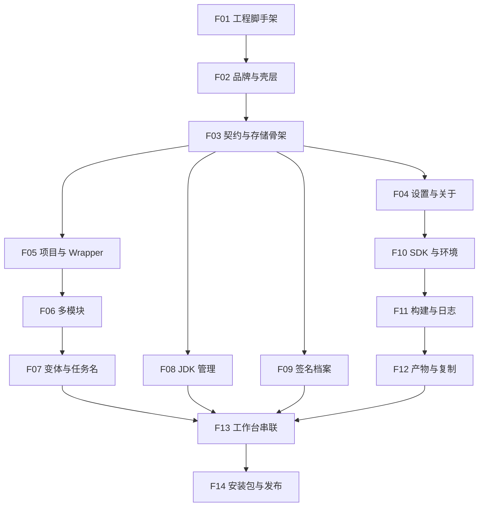

# PackForge 开发任务索引

本目录把 [docs/PRD.md](../docs/PRD.md) 拆成 **14 个可顺序执行** 的开发任务。全部完成后，软件应达到：**可开发运行、主路径可用、当前 OS 可打出安装包**。

| 字段 | 内容 |
|------|------|
| 对应 PRD | v1.1（MVP：FR-01～FR-10） |
| 技术栈 | Electron 33 + React 19 + TypeScript 5 + Vite + Tailwind 4 + Zustand |
| 远程 | `git@github.com:CongDuang/PackForge.git` |
| 任务状态约定 | 各任务文件 frontmatter / 文首：`pending` → `in_progress` → `done` |

---

## 1. 如何执行一个任务

在任意会话中说：

- `开始执行 F01`
- 或 `执行 F07`

执行者（Agent）**必须**：

1. 先读本索引与对应 `Fxx-*.md` 全文，再读其「依赖任务」已落地的代码与冻结契约。
2. 将该任务文首状态改为 `in_progress`。
3. **只做该任务范围**内的文件与行为；不得顺手做下一号。
4. 契约（IPC 名、错误码、数据模型、store key）一旦在更早任务冻结：**只能追加，不得改名/改语义**。
5. 完成后对照任务内「验收清单」自检。
6. **自动**使用项目 skill [commit-and-push](../.cursor/skills/commit-and-push/SKILL.md) 提交并推送（含任务状态改为 `done` 的变更）。
7. 用户事后校验；发现问题在后续会话修复（可再 commit-and-push）。

---

## 2. 顺序与依赖

**会话默认按编号串行：** `F01 → F02 → … → F14`。

说明：F08 / F09 在 F03 冻结后理论上可与 F05–F07 并行；为减少冲突，**会话仍按编号顺序执行**。

---

## 3. 任务一览

| 编号 | 文件 | 标题 | 依赖 | 对应 PRD |
|------|------|------|------|----------|
| F01 | [F01-scaffold.md](F01-scaffold.md) | 工程脚手架 | — | §5 |
| F02 | [F02-shell-brand.md](F02-shell-brand.md) | 品牌与壳层 | F01 | §6 §7 |
| F03 | [F03-contracts-store.md](F03-contracts-store.md) | 契约与存储骨架 | F02 | §11 §12 §15 |
| F04 | [F04-settings-about.md](F04-settings-about.md) | 设置与关于 | F03 | FR-09 §7.3 |
| F05 | [F05-project-wrapper.md](F05-project-wrapper.md) | 项目与 Wrapper | F03 | FR-01 |
| F06 | [F06-modules.md](F06-modules.md) | 多模块 | F05 | FR-02 |
| F07 | [F07-variants-tasks.md](F07-variants-tasks.md) | 变体与任务名 | F06 | FR-03 §9 |
| F08 | [F08-jdk.md](F08-jdk.md) | JDK 管理 | F03 | FR-04 |
| F09 | [F09-signing.md](F09-signing.md) | 签名档案 | F03 | FR-05 §12 |
| F10 | [F10-sdk-env.md](F10-sdk-env.md) | SDK 与环境 | F04 F08 | FR-08 |
| F11 | [F11-build-logs.md](F11-build-logs.md) | 构建与日志 | F07 F09 F10 | FR-06 |
| F12 | [F12-artifacts-copy.md](F12-artifacts-copy.md) | 产物与复制 | F11 | FR-07 §10 |
| F13 | [F13-workbench.md](F13-workbench.md) | 工作台串联 | F07 F08 F09 F12 | §4.3 §7 |
| F14 | [F14-packaging.md](F14-packaging.md) | 安装包与发布 | F13 | FR-10 §6 |

---

## 4. 与 PRD FR 对照

| FR | 说明 | 任务 |
|----|------|------|
| FR-01 | 项目路径 + Wrapper | F05 |
| FR-02 | 多模块 | F06 |
| FR-03 | buildType / flavor / 任务拼装 | F07 |
| FR-04 | JDK 导入与选择（无下载） | F08 |
| FR-05 | 签名档案 + injected signing | F09 |
| FR-06 | 执行打包与日志 | F11 |
| FR-07 | 产物发现与复制分享 | F12（**无拖出**） |
| FR-08 | Android SDK 检测 | F10 |
| FR-09 | 隐私与本地性声明 | F04 |
| FR-10 | 跨平台安装包 | F14 |

---

## 5. 刻意不做（本序列 / MVP）

- JDK 在线下载、镜像、应用内缓存安装包
- 产物**拖出**到访达 / 微信等（仅：复制到文件夹、复制路径、文件剪贴板）
- 遥测 / 崩溃上报云端
- 修改工程 `build.gradle(.kts)` / 默认不改 `local.properties`
- 调用 Android Studio 内置 Gradle 或系统全局 `gradle`
- PRD v1.1/v1.2：JDK 路径扫描一键导入、构建历史、任务队列、自定义任务名自由输入等

---

## 6. 建议演示工程（用户验收用）

准备一个本地 Android 工程，建议具备：

- 根目录含 `gradlew` / `gradlew.bat` 与 `settings.gradle(.kts)`
- 至少一个应用模块（最好名含 `app`）
- 至少一个 productFlavor + `debug`/`release`（便于验 `assembleProdRelease` / `bundleProdRelease`）
- 本机已装 JDK 17 或 21；SDK 可通过环境变量或 `local.properties` 解析

---

## 7. 完成定义（全部 F01–F14 后）

- [ ] `npm install && npm run dev` 可打开「匠包」
- [ ] 主路径：选项目 → 选模块/变体 → 选 JDK →（可选）签名 → 打包 → 日志 → 复制产物
- [ ] 缺 Wrapper / SDK / JDK / 构建失败时错误码与人话提示符合 PRD §15
- [ ] 密码不进明文 store；日志与命令预览脱敏
- [ ] 当前开发机 OS 上 `electron-builder` 能产出可安装包并启动
- [ ] Windows NSIS 配置已写好（若在 mac 开发，文档注明交叉验证步骤）
- [ ] 本索引「可发布」勾选

**可发布：** [ ]

---

## 8. 禁止改已冻结契约

F03 起冻结的类型、IPC channel、错误码、store key，后续任务：

- 允许：**新增** channel / 字段（向后兼容）
- 禁止：重命名、删除、改变返回值语义

若必须破坏性变更：先改 PRD，再开修复会话，并更新所有引用任务文档。
